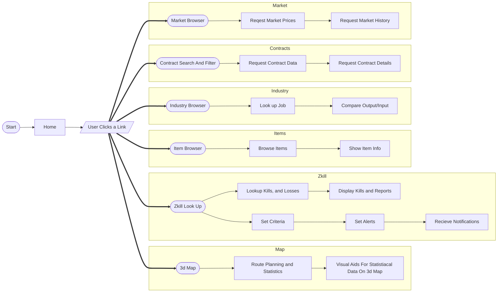

# CCP WebGL Library

---

An implementation of CCP Games graphics engine in webgl

## File Structure

- `electron-app/`
  - `src/`
    - `main.js`
    - `index.html`
    - `assets/`
      - `css/`
        - styles.css
      - `images/`
        - `ship_images/`
          - `ship1.png`
          - `ship2.png`
          - `...`
        - `item_images/`
          - `item1.png`
          - `item2.png`
          - `...`
  - `modules/`
    - `fitting/`
      - `ShipFittingSimulator.js`
      - `fitting.css`
    - `map/`
      - `MapTool.js`
      - `routePlanning.js`
      - `map.css`
    - `zkill/`
      - `ZkillSection.js`
      - `zkill.css`
    - `items/`
      - `ItemBrowser.js`
      - `ShowItemInfo.js`
      - `items.css`
    - `industry/`
      - `IndustrySection.js`
      - `jobLookup.js`
      - `compareOutputInput.js`
      - `industry.css`
    - `contracts/`
      - `ContractsSection.js`
      - `contractSearch.js`
      - `requestContractDetails.js`
      - `contracts.css`
    - `market/`
      - `MarketSection.js`
      - `requestMarketPrices.js`
      - `requestMarketHistory.js`
      - `market.css`
  - `utils/`
    - `api.js`
    - `helpers.js`
  - `package.json`
  - `package-lock.json`
  - `README.md`
  - `LICENSE.md`

## Flowchart

## Core files

| File Name                | Summary                                                                   |
| ------------------------ | ------------------------------------------------------------------------- |
| `dist/ccpwgl_int.js`     | ccp webgl core library                                                    |
| `dist/ccpwgl_int.min.js` | minified ccp webgl core library                                           |
| `dist/ccpwgl.js`         | An example implementation of the ccp webgl library (_required for demos_) |

## Demos

- `demo/index.html` - A collection of ccpwgl demonstrations
- `demo/sof.html` - Shows how to load ships using Space Object Factory and how to query its data
- `demo/planets.html` - Shows how to load planets
- `demo/sun.html` - Shows how to load suns (lens flares)
- `demo/tech3.html` - Shows how to load Tech III composite ships
- `demo/cubeofdeath.html` - Performance test (multiple ships)
- `demo/fitting.html` - Shows how to fit turrets on the ship
- `demo/firing.html` - Shows how to fire turrets
- `demo/explosions.html` - Shows how to construct, play and remove explosions
- `demo/typeids.html` - Shows how to query type ID data

## Updates

- This project now uses webpack instead of grunt
- The glMatrix library is now included in the library to simplify dependencies

## Installation

1. Install [Node.js](http://www.nodejs.org) along with the node package manager
2. Clone `git clone https://github.com/ccpgames/ccpwgl.git`
3. Run `npm install` once from your ccpwgl folder

## Build

- Run `webpack` to lint, format and build `dist/ccpwgl_int.js` and `dist/ccpwgl_int.min.js`
- Run `npm run watcher` to automatically rebuild `dist/ccpwgl_int.js` and `dist/ccpwgl_int.min.js` while developing
